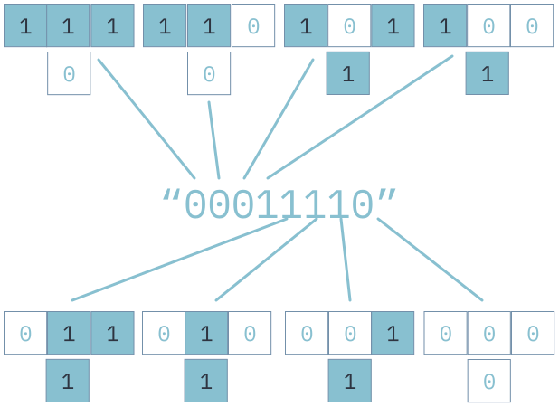

# Elementary Cellular Automata
Put simply, a cellular automaton is a collection "cells" that exist in a binary state of either living or dead. With each discrete time-step from 
          some initial state, a new generation of cells is created. The state of each cell in the new generation is completely determined by its state and 
          the state of its immediate neighbors in the previous generation. The functions that determine the new cell's state are called rules.

This program visualizes Elementary Cellular Automata, with each row being the generation created from the above row.
          The term elementary just means that these are one-dimensional cellular automata  - we only have a line of cells, so to speak.
          This means that the way a cell is updated in each generation only depends on its current state and the states of its left and right neighbors. Let's see a couple of possible configurations, where 0 represents dead and 1 alive:

These are 4 possible configurations of the cell we want to update (middle in each group of 3), and its two neighbors. In fact, since we only consider 3 cells, there are only 23 = 8 possible 
          configurations of 3 living/dead cells.

The way we would update the cell in the middle for each of these 8 different configurations is completely arbitrary. For example, we could say that the first group of 3 will make the middle cell die, the 2nd group makes it live, and so on.
          The key idea is that a configuration of 3 cells is mapped to the state of the middle cell in the next generation.

We do this mapping with functions, commonly referred to as rules. Since there are 8 possible configurations of a group of 3 cells and each configuration maps to whether or not the cell 
          in the middle lives or dies (2 outcomes), there are 28 = 256 such rules. So, a rule determines how one generation of cells is transformed into the next.

We can determine the update from the rule number using Wolfram Code, developed by Stephen Wolfram. In short, we convert the rule number to a binary of length 8, then look at each
          digit of the binary string. The i-th digit represents the outcome of seeing the i-th configuration. For example, if the 5-th digit of the binary string were <b>1</b>, then we know that 
          the configuration <b>101</b> (alive, dead, alive) results in the middle cell becoming a <b>1</b> in the next generation. This is because 5 in binary is <b>101</b>.

As a full example, let's say we are using rule number 30. Converting this to a binary string of width 8, we get <b>00011110</b>2. The following
        image shows the complete update rule, where the cell below each group of 3 is the state of the middle cell in the next generation.

